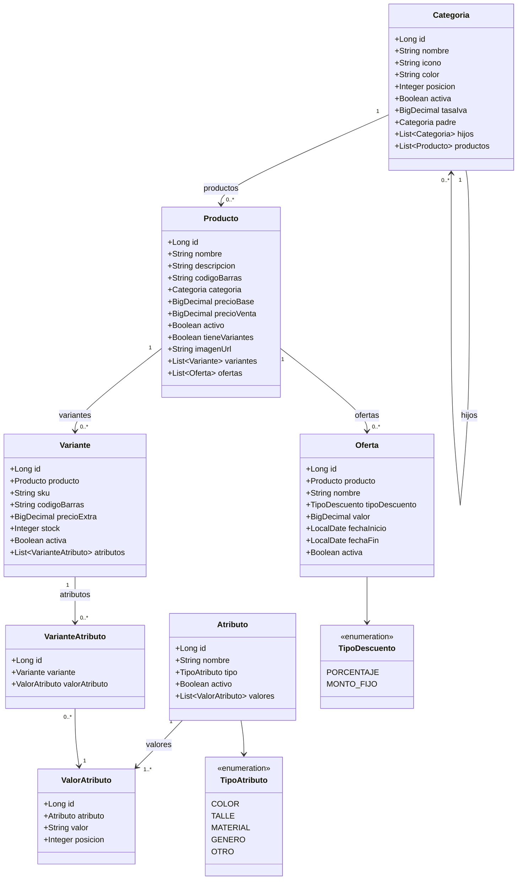
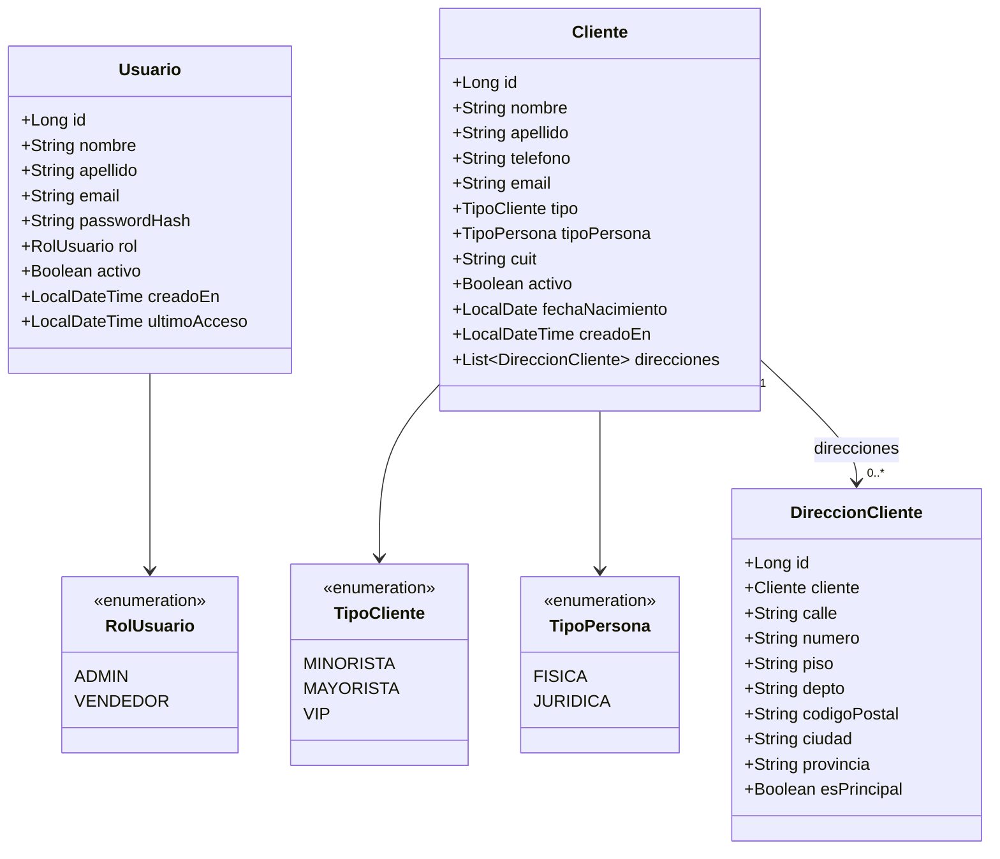
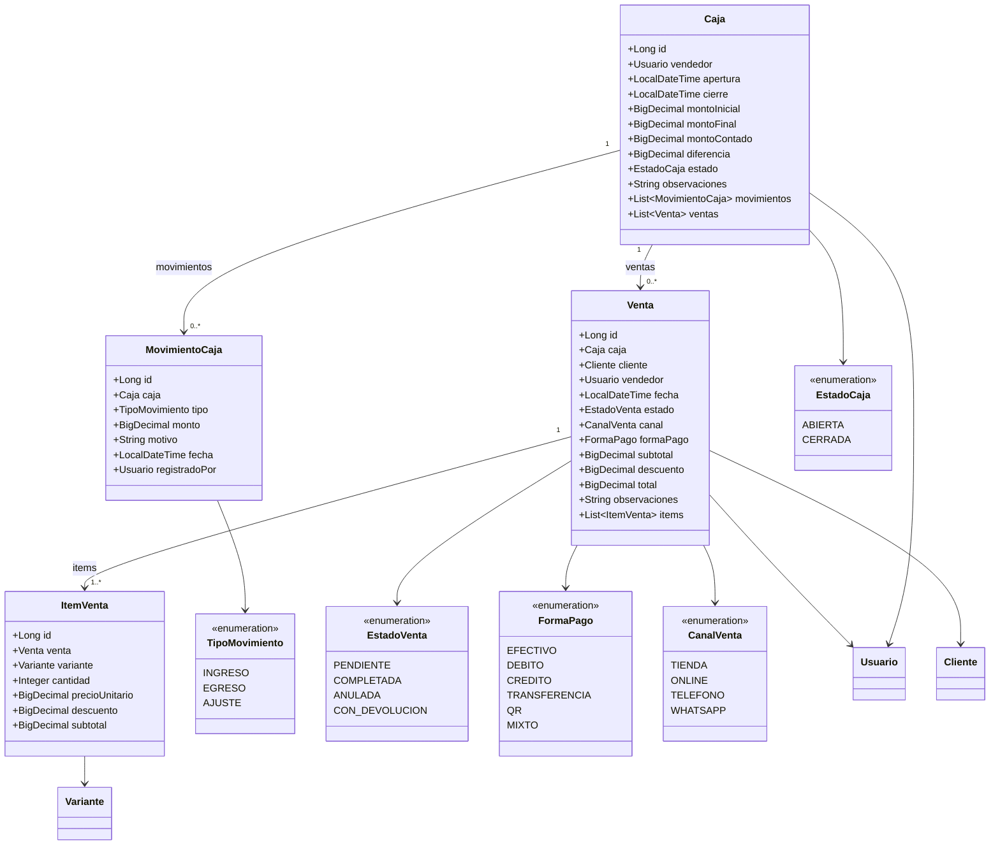
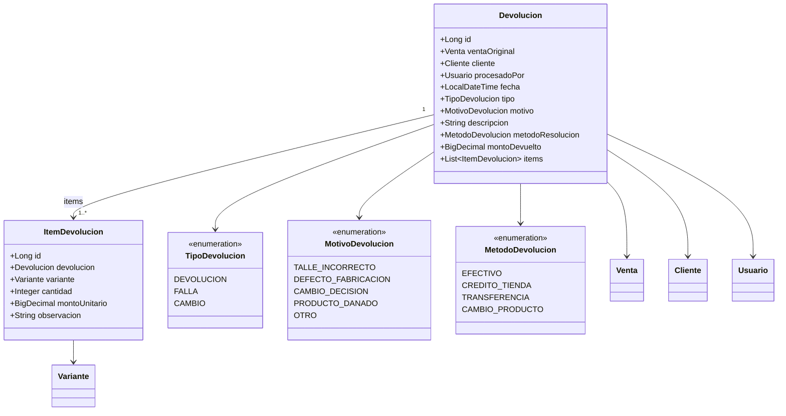
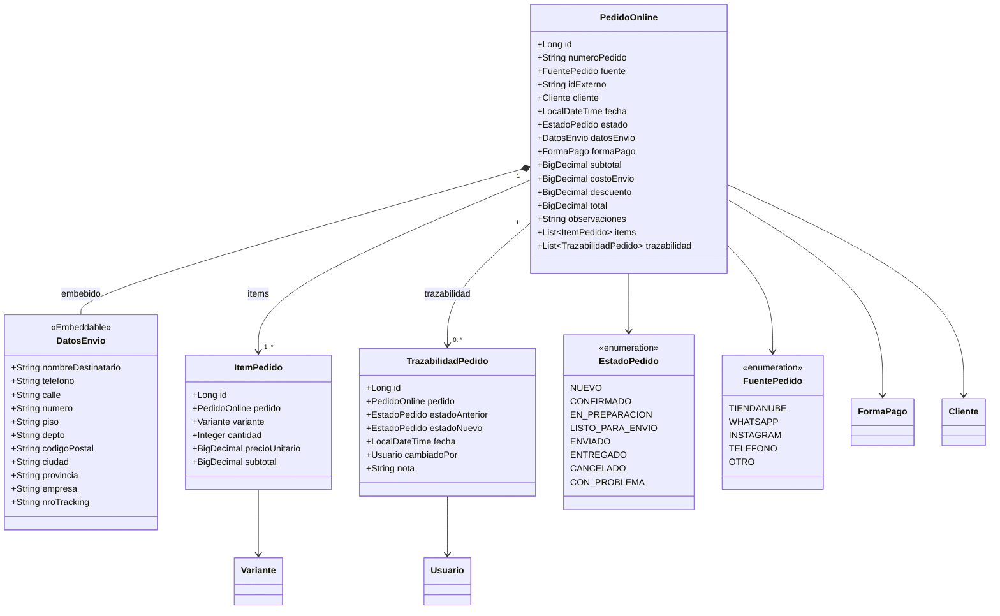
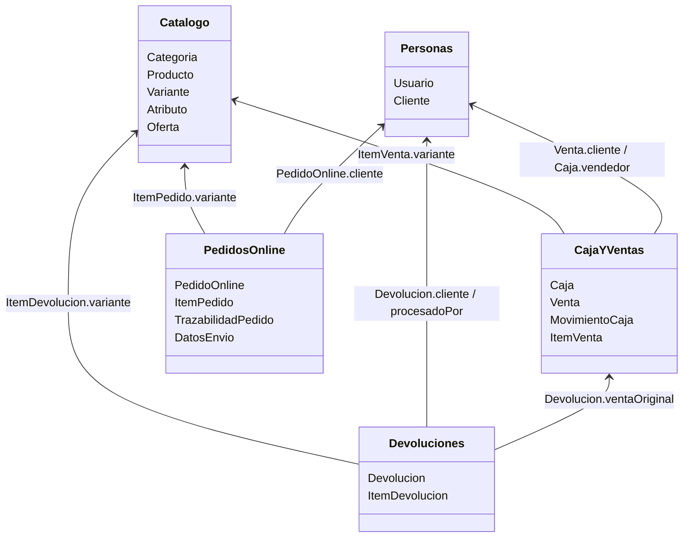

# Diagramas de Clases — Backend Edhen POS

Referencia para el diseño del backend Spring Boot + PostgreSQL.
Tecnologías: Java 17, Spring Boot 3, JPA/Hibernate, PostgreSQL.

---

## Grupo 1 — Catálogo

Entidades para gestionar el catálogo de productos, variantes, atributos y ofertas.

---

## Grupo 2 — Personas

Usuarios del sistema (admin/vendedor) y clientes del negocio.

---

## Grupo 3 — Caja y Ventas

Gestión de turnos de caja, movimientos y ventas en tienda.

---

## Grupo 4 — Devoluciones

Registro de devoluciones y fallas de productos.

---

## Grupo 5 — Pedidos Online

Pedidos recibidos por TiendaNube, WhatsApp u otros canales digitales.

---

## Mapa General de Relaciones

Vista de alto nivel de cómo se conectan los 5 grupos.

---

## Notas de Implementación

### Prioridad de desarrollo sugerida

1. **Enums** — sin dependencias, ir primero
2. **Catálogo** — Categoria → Atributo → ValorAtributo → Producto → Variante → Oferta
3. **Personas** — Usuario → Cliente → DireccionCliente
4. **Caja y Ventas** — Caja → MovimientoCaja → Venta → ItemVenta
5. **Devoluciones** — Devolucion → ItemDevolucion
6. **Pedidos Online** — PedidoOnline → ItemPedido → TrazabilidadPedido

### Convenciones Java/JPA

- Usar `BigDecimal` para todos los campos monetarios (nunca `double`)
- `DatosEnvio` va como `@Embeddable` dentro de `PedidoOnline` (misma tabla)
- Colecciones: `@OneToMany(mappedBy = ..., cascade = CascadeType.ALL, orphanRemoval = true)`
- Borrado lógico: campo `activo / Boolean` en Producto, Variante, Usuario, Cliente
- Timestamps: `LocalDateTime` con `@CreatedDate` / `@LastModifiedDate` de Spring Data
- Todos los `@ManyToOne` son `FetchType.LAZY` por defecto
